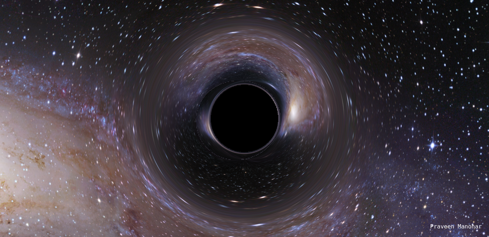

# Black Hole Stimulation

A Web page for understing how Blackhole can collapse a galaxy. It was simple stimulation created with Threejs + WebGL.

***For a live demo, visit [Blackhole](https://praveen-manohar.github.io/Blackhole-stimulation/) on your Desktop.

***Usage:
**Educational Purposes only
To understand the blackhole collide with universe on web.

***To change the universe image, go to line 40 and change the res/"image name"

  <pre class="wp-block-preformatted">new THREE.TextureLoader()).load("res/andromeda.jpeg", function (texture)</pre>
  
***Need to add:

* Set more number of unvierse pictures.
* Make it more realistic
* Add more physics 

Any kind of **contributions** are welcome....
